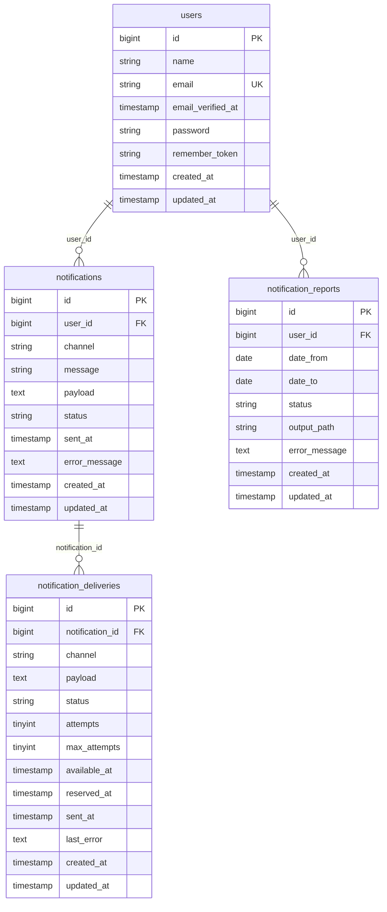

# Агентство Недвижимости Жилфонд

Проект на Laravel 13 с Docker-окружением через Laravel Sail и базой данных MySQL.

## Требования

- Docker и Docker Compose
- PHP и Composer на хосте **не обязательны** — для первого `composer install` достаточно Docker (см. ниже)

## Первый запуск (после `git clone`)

Каталог `vendor/` в git не попадает, но без него не заработают ни `./vendor/bin/sail`, ни сборка образа в `compose.yaml` (пути ведут в `vendor/laravel/sail/...`). Сначала установите зависимости, затем поднимайте контейнеры.

### Без Composer и PHP на хосте (только Docker)

Из корня репозитория один раз подтянуть зависимости в `vendor/`:

```bash
docker run --rm \
    -u "$(id -u):$(id -g)" \
    -v "$(pwd):/var/www/html" \
    -w /var/www/html \
    laravelsail/php84-composer:latest \
    composer install --ignore-platform-reqs
```

Образ уже содержит PHP и Composer; на машине нужен только запущенный Docker. Флаг `--ignore-platform-reqs` нужен, потому что версия PHP в образе может отличаться от той, что в контейнере приложения (8.5) — на установку пакетов это не влияет.

Дальше — общие шаги 2–5 ниже (`sail up`, ключ, миграции).

### Если Composer установлен локально

```bash
composer install
```

Дальше — те же шаги 2–5.

### Общие шаги (после появления `vendor/`)

2. **Файл окружения.** Обязательно должен быть `.env` в корне проекта. Если после `composer install` его нет:

   ```bash
   cp .env.example .env
   ```

3. **Запустить контейнеры:**

   ```bash
   ./vendor/bin/sail up -d
   ```

4. **Ключ приложения** (обязательно, пока в `.env` пустой `APP_KEY`):

   ```bash
   ./vendor/bin/sail artisan key:generate
   ```

5. **Миграции и сиды** (в БД появится тестовый пользователь — обычно `id = 1` для примеров API):

   ```bash
   ./vendor/bin/sail artisan migrate --seed
   ```

Приложение будет доступно по адресу из `APP_URL` (по умолчанию `http://localhost:8080`).

## Быстрый старт (уже настроенный проект)

```bash
./vendor/bin/sail up -d
```

## Основные команды

### Управление окружением

```bash
./vendor/bin/sail up -d      # поднять контейнеры
./vendor/bin/sail down       # остановить контейнеры
./vendor/bin/sail logs -f    # смотреть логи
```

### PHPStan (уровень 5)

Проверка статического анализа:

```bash
./vendor/bin/sail composer phpstan
```

Конфигурация находится в файле `phpstan.neon`.

### Code style (Laravel Pint)

Проверка стиля без изменений файлов:

```bash
./vendor/bin/sail composer lint
```

Автоматическое исправление стиля:

```bash
./vendor/bin/sail composer lint:fix
```

Конфигурация находится в файле `pint.json`.

## Архитектура уведомлений

- Используется табличная очередь в MySQL: `notification_deliveries`
- Основная сущность уведомления: `notifications`
- `payload` хранится как `text` (строка) и передается в канал доставки
- Каналы изолированы по классам и реализуют единый контракт `App\Contracts\NotificationChannel`
    - `EmailNotificationChannel`
    - `TelegramNotificationChannel`
- Выбор канала выполняет `NotificationChannelManager`, поэтому добавление нового канала не требует изменения существующих каналов
- Обработчик `notifications:work` берёт задачи из таблицы, отправляет, обновляет статусы и делает retry с backoff
- Отчёты (доп. задание): таблица `notification_reports`, генерация в job `GenerateNotificationReportJob`, файл в `storage/app/private/reports/...` (диск `local`), статусы `pending` → `processing` → `completed` / `failed`

## Схема БД



## API уведомлений

### Создать уведомление

Пример curl:

```bash
curl -X POST http://localhost/api/notifications \
  -H "Content-Type: application/json" \
  -d '{
    "user_id": 1,
    "channel": "email",
    "message": "Новое предложение по объекту",
    "payload": "Дополнительные данные для канала доставки"
  }'
```

### Получить статус уведомления

`GET /api/notifications/{id}`

### История пользователя с фильтрами

`GET /api/users/{userId}/notifications?status=sent&channel=email`

Если пользователя с таким `id` нет, будет **404** и сообщение вроде `No query results for model [App\Models\User]`. Полный `trace` в ответе появляется при `APP_DEBUG=true` (локально по умолчанию).

## Отчёты по уведомлениям (дополнительное задание)

Отчёт за период считает по таблице `notifications` для пользователя: **число уведомлений по каждому каналу** и **число ошибок** (записи со статусом `error`) по каждому каналу. Результат — **текстовый файл** на внутреннем диске (`storage/app/private`, диск `local`).

Почему не «один запрос и всё»: даже при одном SQL сценарий **может оборваться** между запросом и записью файла (OOM, `SIGKILL`, таймаут воркера, сбой диска, падение PHP). Поэтому генерация вынесена в **очередь**: у заказа есть статусы; файл сначала пишется как `.tmp`, затем **атомарно** переименовывается в `.txt`; при исключении статус **`failed`**, сообщение об ошибке в БД, временный файл удаляется. Пока отчёт не готов, скачивание отвечает **409**; при неудачной генерации — **422** с текстом ошибки.

При `QUEUE_CONNECTION=sync` (в т.ч. в тестах) job выполняется сразу в том же процессе. В проде обычно `database` или `redis` — тогда нужен воркер:

```bash
./vendor/bin/sail artisan queue:work
```

### Заказать отчёт

`POST /api/users/{userId}/notification-reports`

Тело (JSON):

```json
{
  "date_from": "2026-05-01",
  "date_to": "2026-05-07"
}
```

Ответ **202**: объект с `id`, `status` (после синхронной очереди уже может быть `completed`), полями периода и т.д.

### Статус

`GET /api/users/{userId}/notification-reports/{reportId}`

### Скачать файл

`GET /api/users/{userId}/notification-reports/{reportId}/download`

Валидация периода — `StoreNotificationReportRequest` (`date_to` не раньше `date_from`).

## Воркер очереди уведомлений

Однократная обработка (удобно для локальной проверки):

```bash
./vendor/bin/sail artisan notifications:work --once
```

Постоянный режим:

```bash
./vendor/bin/sail artisan notifications:work
```

## Что улучшить для продакшна

### Очередь и брокер

Вынести асинхронную обработку доставок из **той же СУБД**, что и доменные данные, в отдельный **брокер сообщений**, например **RabbitMQ**: **durable**-очереди, **persistent**-сообщения, подтверждения публикации и потребления, при необходимости **DLX** для «ядовитых» сообщений и политики TTL/retry на стороне брокера. Так снижается конкуренция за ресурсы БД и проще масштабировать воркеры и маршрутизацию по каналам. 


